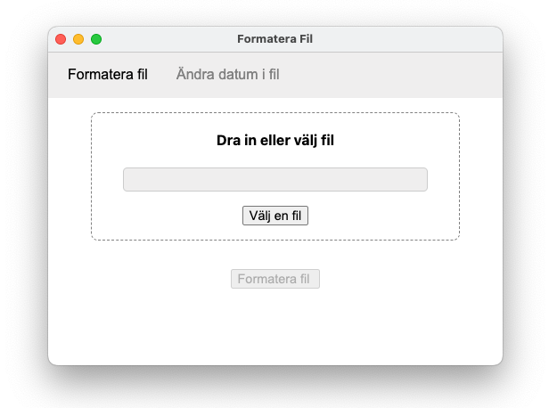
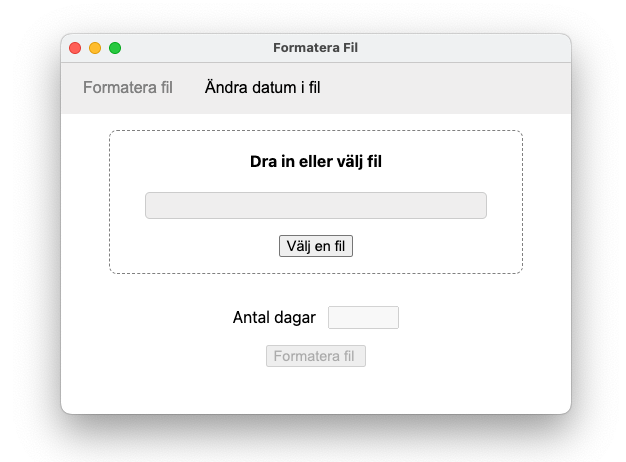

# AIP-FORMAT-FILE
Swedish application purpose-built for a company to convert files between different systems.

## Images

### Development Gotchas:
* Github Publisher is using the version specify in package.json
